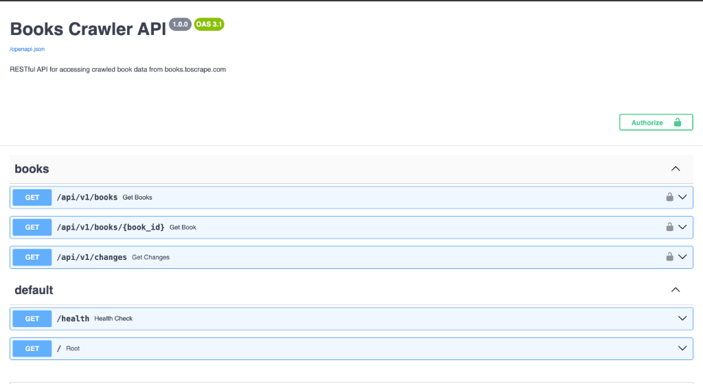
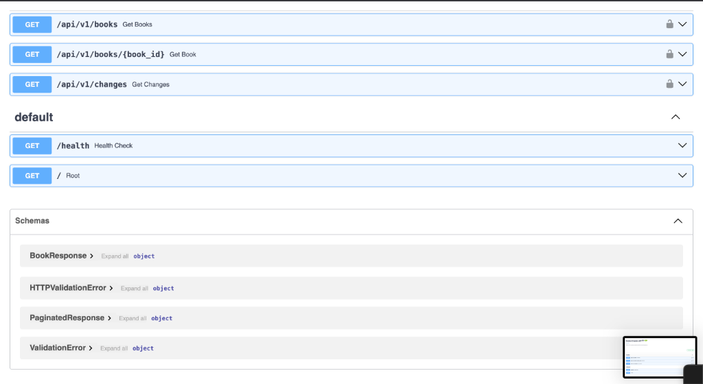
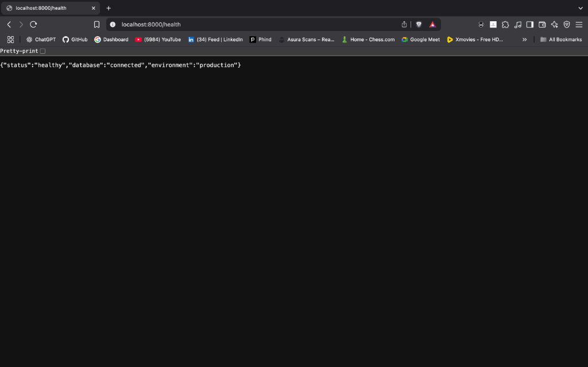
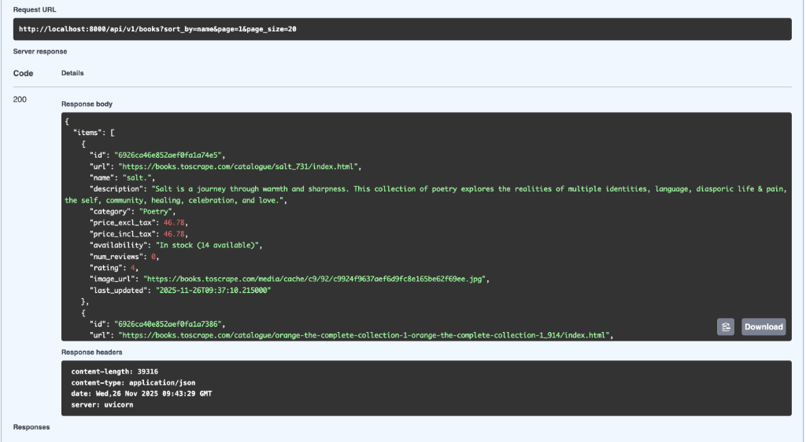
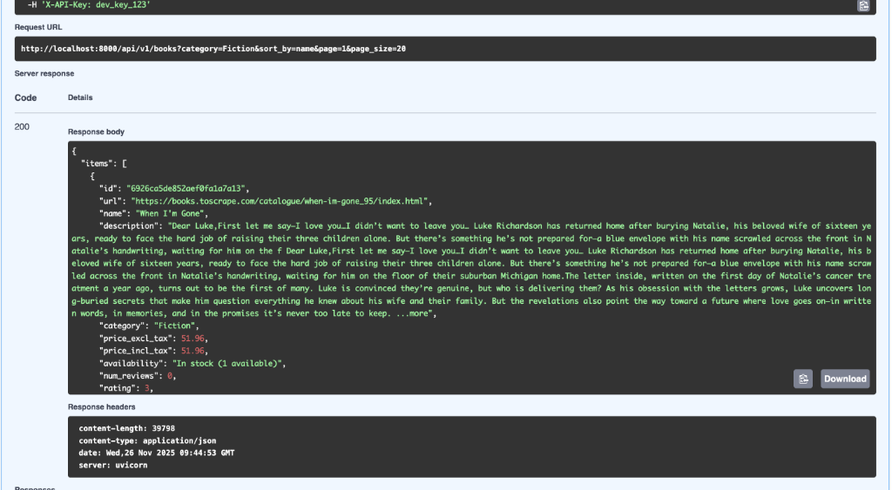
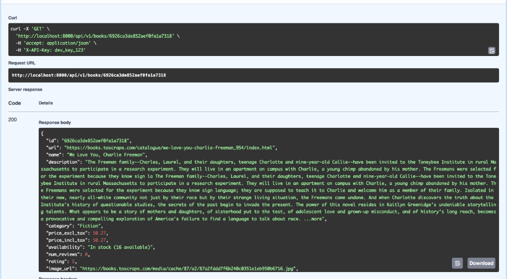

# Books Crawler - Web Scraping Project

A production-grade web crawling system for monitoring and serving book data from [books.toscrape.com](https://books.toscrape.com). This system includes an async web crawler, change detection scheduler, and secure RESTful API.

## Features

### 🕷️ Robust Web Crawler
- **Async crawling** with httpx for high performance
- **Retry logic** with exponential backoff
- **Resume capability** to continue from last successful crawl
- **Progress tracking** with MongoDB persistence
- **HTML snapshots** stored in GridFS for fallback
- **Concurrent requests** with configurable semaphore limits

### 📊 Change Detection & Scheduling
- **Daily scheduler** using APScheduler
- **Content hash comparison** for efficient change detection
- **Change logging** for price, availability, and description updates
- **Report generation** in JSON and CSV formats
- **Alert system** (email/log) for significant changes

### 🔐 Secure RESTful API
- **API key authentication** for secure access
- **Rate limiting** (100 requests/hour per key)
- **Advanced filtering** by category, price, rating
- **Sorting** by name, rating, price, reviews
- **Pagination** support for large datasets
- **OpenAPI/Swagger** documentation

## 📸 Proof of Working System

All screenshots demonstrating the fully functional system are available in the [`proof/`](./proof) directory.

### 1. Swagger API Documentation
Interactive API documentation with all endpoints and schemas.





### 2. Health Check - Database Connected
Confirms MongoDB connection and system health.



### 3. Get All Books - API Response
Successfully retrieved books with authentication (1000 books crawled).



### 4. Filter Books by Category
Filtering books by "Fiction" category with API key authentication.



### 5. Get Book by ID
Retrieving full details of a specific book using its MongoDB ObjectId.



**System Status**: ✅ **1000/1000 books successfully crawled and stored in MongoDB**


## Project Structure

```
books-crawler/
├── crawler/              # Web scraping logic
│   ├── scraper.py       # Async crawler with retry logic
│   ├── parser.py        # HTML parsing utilities
│   └── storage.py       # MongoDB operations
├── scheduler/           # Scheduled tasks
│   ├── jobs.py         # APScheduler job definitions
│   └── change_detector.py  # Change detection logic
├── api/                # RESTful API
│   ├── main.py         # FastAPI application
│   ├── routes.py       # API endpoints
│   ├── auth.py         # Authentication & rate limiting
│   └── models.py       # Pydantic models
├── utilities/          # Shared utilities
│   ├── config.py       # Configuration management
│   ├── database.py     # MongoDB connection
│   └── logging_config.py  # Logging setup
├── tests/              # Test suite
│   ├── test_crawler.py
│   ├── test_api.py
│   └── test_scheduler.py
├── main.py             # Application entry point
├── requirements.txt    # Python dependencies
├── Dockerfile          # Docker image definition
├── docker-compose.yml  # Multi-container setup
└── .env.example        # Environment variables template
```

## Setup Instructions

### Prerequisites
- Python 3.11+
- MongoDB 7.0+
- Docker & Docker Compose (optional)

### Local Setup

1. **Clone the repository**
```bash
git clone <repository-url>
cd books-crawler
```

2. **Create virtual environment**
```bash
python -m venv venv
source venv/bin/activate  # On Windows: venv\Scripts\activate
```

3. **Install dependencies**
```bash
pip install -r requirements.txt
```

4. **Set up environment variables**
```bash
cp .env.example .env
# Edit .env with your configuration
```

5. **Start MongoDB**
```bash
# Using Docker
docker run -d -p 27017:27017 --name mongodb mongo:7.0

# Or install MongoDB locally
brew install mongodb-community@7.0  # macOS
```

### Docker Setup

1. **Build and run with Docker Compose**
```bash
docker-compose up --build
```

This will start:
- MongoDB on port 27017
- API server on port 8000
- Scheduler service

2. **Access the API**
- API: http://localhost:8000
- Swagger docs: http://localhost:8000/docs
- Health check: http://localhost:8000/health

## Usage

### Running the Crawler

```bash
# Run full crawl
python main.py crawl

# Resume from last crawl
python main.py crawl --resume
```

### Running the Scheduler

```bash
# Start scheduler (runs daily at 2 AM and 3 AM)
python main.py schedule
```

### Running the API Server

```bash
# Start API server
python main.py api

# Or with uvicorn directly
uvicorn api.main:app --host 0.0.0.0 --port 8000
```

## API Documentation

### Authentication

All API endpoints require an API key in the `X-API-Key` header:

```bash
curl -H "X-API-Key: dev_key_123" http://localhost:8000/api/v1/books
```

### Endpoints

#### GET /api/v1/books

Get books with filtering, sorting, and pagination.

**Query Parameters:**
- `category` (string): Filter by category
- `min_price` (float): Minimum price filter
- `max_price` (float): Maximum price filter
- `rating` (int): Filter by rating (1-5)
- `sort_by` (string): Sort field (name, rating, price, reviews)
- `page` (int): Page number (default: 1)
- `page_size` (int): Items per page (default: 20, max: 100)

**Example:**
```bash
curl -H "X-API-Key: dev_key_123" \
  "http://localhost:8000/api/v1/books?category=Fiction&min_price=10&max_price=50&rating=4&page=1"
```

#### GET /api/v1/books/{book_id}

Get full details of a specific book.

**Example:**
```bash
curl -H "X-API-Key: dev_key_123" \
  http://localhost:8000/api/v1/books/507f1f77bcf86cd799439011
```

#### GET /api/v1/changes

View recent changes with filtering and pagination.

**Query Parameters:**
- `start_date` (datetime): Start date filter
- `end_date` (datetime): End date filter
- `change_type` (string): Filter by change type
- `page` (int): Page number
- `page_size` (int): Items per page

**Example:**
```bash
curl -H "X-API-Key: dev_key_123" \
  "http://localhost:8000/api/v1/changes?change_type=price_change&page=1"
```

## Environment Variables

| Variable | Description | Default |
|----------|-------------|---------|
| `MONGODB_URI` | MongoDB connection string | `mongodb://localhost:27017` |
| `DATABASE_NAME` | Database name | `books_crawler` |
| `API_KEYS` | Comma-separated API keys | `dev_key_123` |
| `RATE_LIMIT_PER_HOUR` | Rate limit per API key | `100` |
| `CRAWLER_CONCURRENCY` | Max concurrent requests | `10` |
| `CRAWLER_MAX_RETRIES` | Max retry attempts | `3` |
| `CRAWLER_TIMEOUT_SECONDS` | Request timeout | `30` |
| `BASE_URL` | Target website URL | `https://books.toscrape.com` |
| `SCHEDULER_INTERVAL_HOURS` | Scheduler interval | `24` |
| `LOG_LEVEL` | Logging level | `INFO` |
| `LOG_FORMAT` | Log format (json/text) | `json` |
| `ENVIRONMENT` | Environment name | `development` |

## Testing

### Run all tests
```bash
pytest tests/ -v
```

### Run with coverage
```bash
pytest tests/ -v --cov=. --cov-report=html
```

### Run specific test file
```bash
pytest tests/test_crawler.py -v
```

## MongoDB Schema

### Books Collection

```json
{
  "_id": ObjectId,
  "url": "https://books.toscrape.com/catalogue/book_123.html",
  "name": "Book Title",
  "description": "Book description...",
  "category": "Fiction",
  "price_excl_tax": 10.99,
  "price_incl_tax": 12.99,
  "availability": "In stock (22 available)",
  "num_reviews": 5,
  "rating": 4,
  "image_url": "https://books.toscrape.com/media/cache/...",
  "content_hash": "abc123...",
  "crawl_metadata": {
    "timestamp": ISODate("2024-01-01T00:00:00Z"),
    "status": "success",
    "source_url": "https://books.toscrape.com/catalogue/book_123.html"
  },
  "html_snapshot_id": ObjectId
}
```

### Change Log Collection

```json
{
  "_id": ObjectId,
  "book_id": "507f1f77bcf86cd799439011",
  "book_name": "Book Title",
  "change_type": "price_change",
  "old_value": {
    "price_incl_tax": 10.99,
    "price_excl_tax": 9.99
  },
  "new_value": {
    "price_incl_tax": 12.99,
    "price_excl_tax": 11.99
  },
  "detected_at": ISODate("2024-01-01T00:00:00Z")
}
```

## Development

### Code Style
- Follow PEP 8 guidelines
- Use type hints where applicable
- Write docstrings for all functions and classes

### Adding New Features
1. Create a new branch
2. Implement feature with tests
3. Update documentation
4. Submit pull request

## Troubleshooting

### MongoDB Connection Issues
```bash
# Check if MongoDB is running
docker ps | grep mongodb

# View MongoDB logs
docker logs books_crawler_mongodb
```

### API Not Responding
```bash
# Check API logs
docker logs books_crawler_app

# Verify health endpoint
curl http://localhost:8000/health
```

### Crawler Failures
- Check MongoDB connection
- Verify network connectivity to books.toscrape.com
- Review crawler logs for specific errors
- Use `--resume` flag to continue from last successful crawl

## Production Deployment

### Security Considerations
1. **Change default API keys** in production
2. **Use environment-specific .env files**
3. **Enable HTTPS** with reverse proxy (nginx/traefik)
4. **Set up MongoDB authentication**
5. **Configure firewall rules**
6. **Use secrets management** (AWS Secrets Manager, HashiCorp Vault)

### Monitoring
- Set up log aggregation (ELK stack, Datadog)
- Configure alerts for crawler failures
- Monitor API response times
- Track MongoDB performance